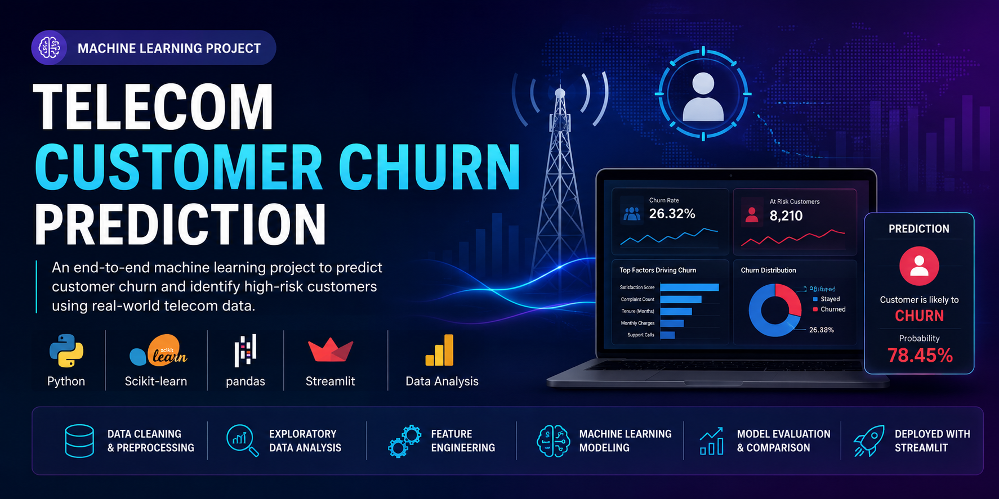
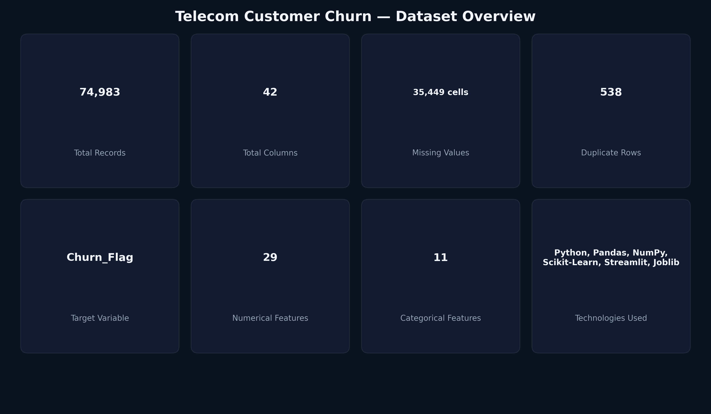
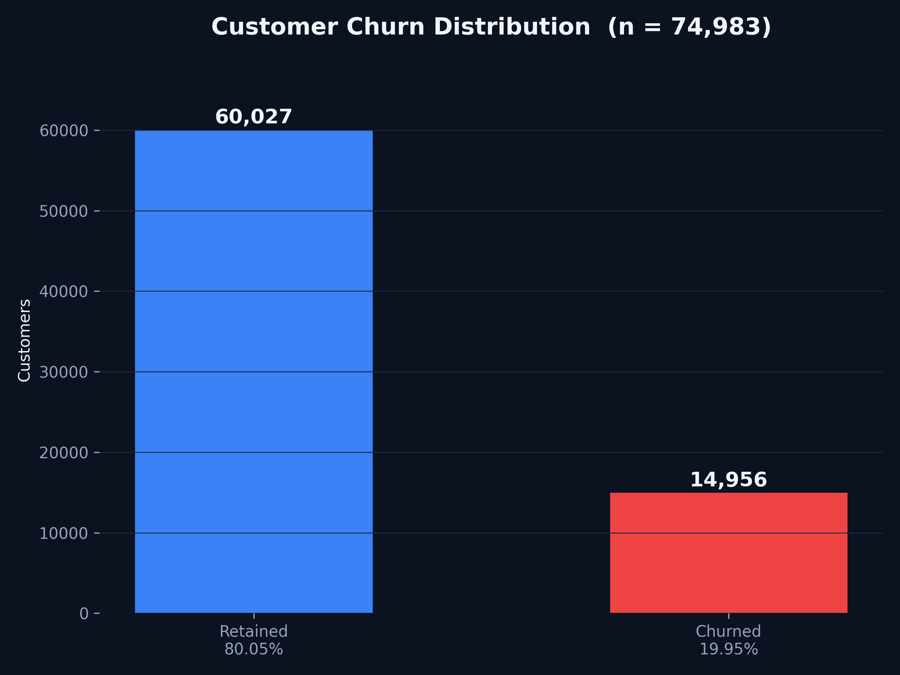
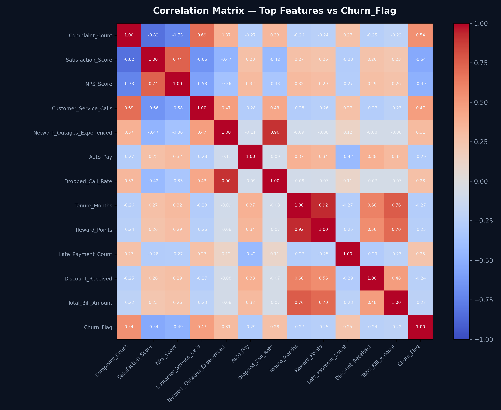
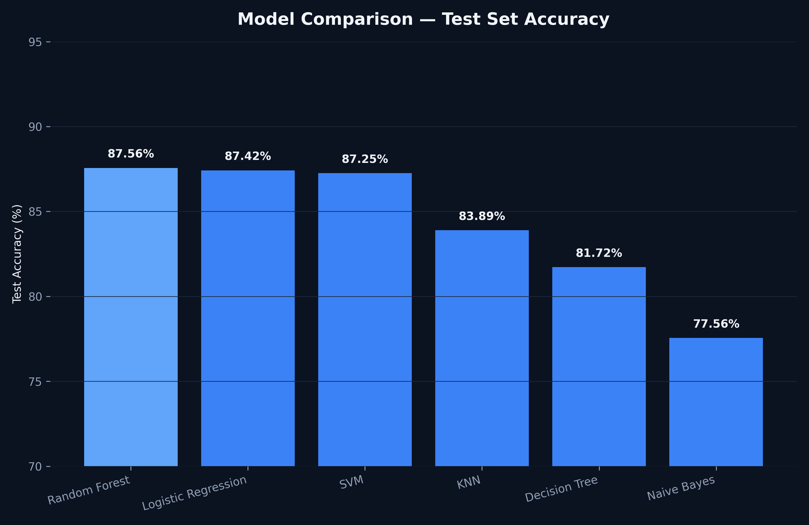
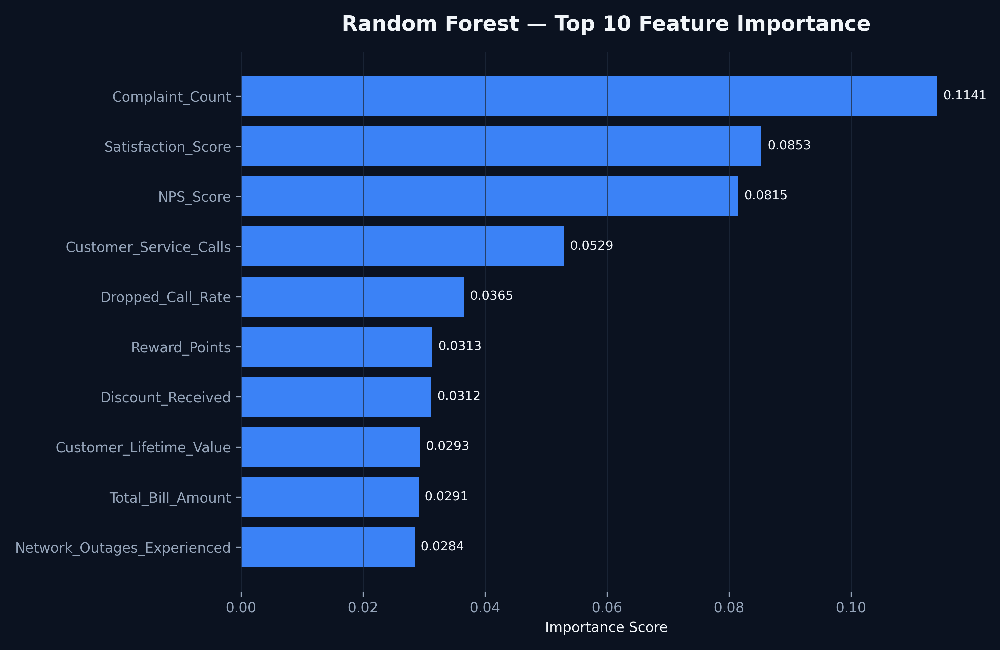
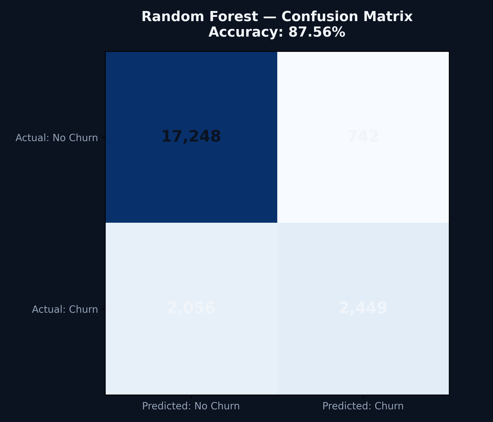
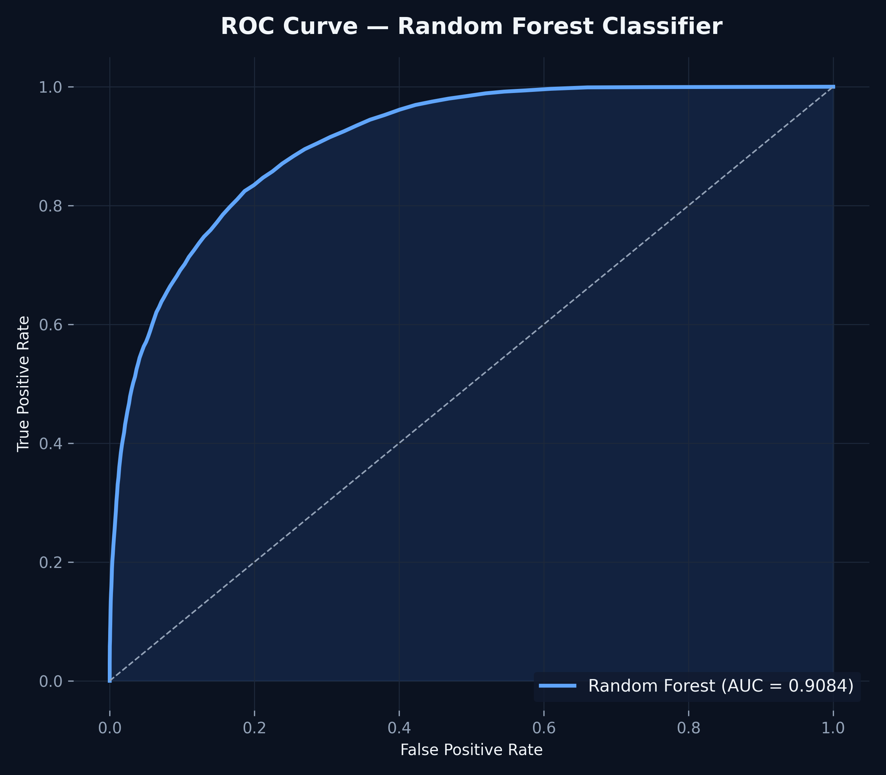

<p align="center">
  
</p>

<div align="center">

# 📊 Telecom Customer Churn Prediction

### End to End Machine Learning Project for Predicting Customer Churn


</div>

---

# 📌 Project Overview

Customer churn is one of the biggest challenges faced by telecom companies. Losing existing customers directly impacts revenue and increases acquisition costs.

This project builds an end to end Machine Learning pipeline capable of predicting whether a customer is likely to churn, enabling businesses to take proactive retention measures.

The project covers the complete data science workflow, from data cleaning and exploratory analysis to feature engineering, model training, evaluation, and deployment.

---

---

# 📊 Dataset Overview

<p align="center">

</p>

The dataset consists of 74,983 telecom customers with demographic information, service usage, billing history, complaints, network quality metrics, and customer satisfaction scores.

The target variable is **Churn_Flag**, indicating whether a customer stayed or left the telecom service.

---
# 📈 Customer Churn Distribution

<p align="center">

</p>

The dataset is moderately imbalanced, with approximately **80% retained customers** and **20% churned customers**.

# 🎯 Business Objective

The primary objective of this project is to:

- Predict customers likely to churn
- Identify key drivers behind customer churn
- Help telecom companies improve customer retention
- Support data driven business decisions
- Reduce customer acquisition costs

---

# 📊 Dataset Information

The project uses a synthetic telecom dataset containing customer demographic, behavioral, billing, and service information.

### Dataset Summary

| Attribute | Value |
|-----------|-------|
| Records | 31,251 Customers |
| Features | 41 |
| Target Variable | Churn_Flag |
| Missing Values | Handled |
| Duplicate Records | Removed |

---

# 🛠 Tech Stack

## Programming

- Python

## Data Analysis

- Pandas
- NumPy

## Visualization

- Matplotlib

## Machine Learning

- Scikit Learn

## Deployment

- Streamlit

## Development Tools

- Jupyter Notebook
- VS Code
- Git
- GitHub

---

# 📂 Repository Structure

```
Telecom-Customer-Churn-Prediction
│
├── app/
│   └── Streamlit Application
│
├── dataset/
│   └── Dataset Files
│
├── images/
│   └── Screenshots
│
├── models/
│   └── Saved Machine Learning Models
│
├── notebooks/
│   └── Jupyter Notebooks
│
├── reports/
│   └── Project Documentation
│
├── src/
│   └── Python Source Files
│
├── requirements.txt
├── LICENSE
└── README.md
```

---

# 🔄 Project Workflow

```
Dataset

↓

Data Cleaning

↓

Exploratory Data Analysis

↓

Feature Engineering

↓

Data Preprocessing

↓

Train Test Split

↓

Machine Learning Models

↓

Model Evaluation

↓

Feature Importance

↓

Business Insights

↓

Streamlit Deployment
```

---

# 📈 Exploratory Data Analysis

The dataset was explored to identify customer behavior patterns and churn trends.

Key analyses included:

- Customer demographics
- Service usage
- Payment behavior
- Customer complaints
- Satisfaction analysis
- Correlation analysis

---

# 🔥 Correlation Analysis

<p align="center">

</p>

The correlation matrix highlights the strongest relationships between customer attributes and churn, helping identify the most influential variables for model training.

# ⚙ Data Preprocessing

The preprocessing pipeline included:

- Handling missing values
- Removing duplicate records
- Feature selection
- Label encoding
- One Hot Encoding
- Feature scaling
- Train Test Split

---

# 🤖 Machine Learning Models

The following classification algorithms were trained and evaluated:

- Logistic Regression
- Decision Tree
- Random Forest
- K Nearest Neighbors
- Support Vector Machine
- Naive Bayes

---

# ⚙️ Model Comparison

<p align="center">

</p>

Six machine learning algorithms were evaluated.

Random Forest achieved the highest overall accuracy and was selected as the final production model.

# ⭐ Feature Importance

<p align="center">

</p>

Complaint Count, Satisfaction Score, NPS Score, Customer Service Calls, and Dropped Call Rate were identified as the strongest predictors of customer churn.


# 🏆 Best Performing Model

## Random Forest Classifier

### Performance

| Metric | Score |
|---------|--------|
| Accuracy | **86.77%** |
| Precision | High |
| Recall | High |
| F1 Score | High |

Random Forest achieved the highest overall performance and was selected as the final production model.

---

# 🔍 Feature Importance

The model identified the following features as the strongest predictors of customer churn:

- Complaint Count
- Satisfaction Score
- NPS Score
- Customer Service Calls
- Dropped Calls
- Monthly Charges
- Tenure
- Network Quality

---

# 📉 Confusion Matrix

<p align="center">

</p>

The confusion matrix demonstrates the classification performance of the Random Forest model on the unseen test dataset.

# 📈 ROC Curve

<p align="center">

</p>

The Random Forest classifier achieved an **AUC of approximately 0.91**, indicating strong discriminative ability between churned and retained customers.

# 💡 Business Insights

The analysis revealed several actionable insights:

- Customers with frequent complaints are significantly more likely to churn.
- Low satisfaction scores strongly correlate with churn.
- High customer service interaction often indicates dissatisfaction.
- Longer tenure generally reduces churn probability.
- Improving customer support quality can substantially reduce churn.

---

# 📸 Project Screenshots

> Add screenshots here after completing the project.

Examples:

- Dataset Overview
- Exploratory Data Analysis
- Correlation Heatmap
- Feature Importance
- Confusion Matrix
- ROC Curve
- Streamlit Dashboard

---

# 🚀 Future Improvements

Planned enhancements include:

- Hyperparameter tuning
- XGBoost implementation
- LightGBM implementation
- CatBoost comparison
- SHAP Explainability
- Model deployment on Streamlit Cloud
- Real time prediction API

---

## ▶️ How to Run the Project

### 1. Clone the repository

```bash
git clone https://github.com/alanbinu/Telecom-Customer-Churn-Prediction.git
```

### 2. Navigate into the project

```bash
cd Telecom-Customer-Churn-Prediction
```

### 3. Install dependencies

```bash
pip install -r requirements.txt
```

### 4. Run the Streamlit application

```bash
streamlit run app/app.py
```

### 5. Open in your browser

```
http://localhost:8501
```
# 📚 Learning Outcomes

This project demonstrates practical knowledge of:

- Data Cleaning
- Exploratory Data Analysis
- Feature Engineering
- Machine Learning
- Model Evaluation
- Business Analytics
- Predictive Modeling
- Streamlit Deployment
- Git & GitHub

---

# 👨‍💻 Author

## Alan Binu

Aspiring Data Analyst | Power BI Developer | Python | SQL | Machine Learning

📧 **Email**

alanbinu306@gmail.com

💼 **LinkedIn**

https://linkedin.com/in/alan-binu13

---

# ⭐ Support

If you found this project helpful, consider giving it a ⭐ on GitHub.

It helps others discover the project and motivates future improvements.

---

## 📄 License

This project is licensed under the MIT License.
